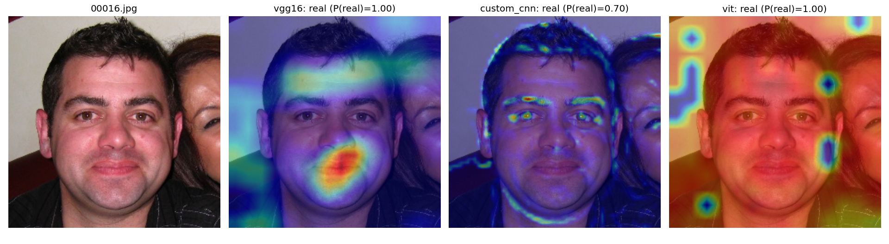
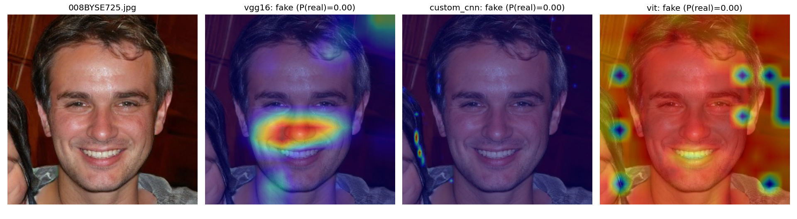

# DeepFake Image Detection

Detects GAN-generated (fake) face images with a weighted-average ensemble of three models: a CNN pretrained on ImageNet (VGG16), a CNN trained from scratch, and a Vision Transformer. The models look at images in different ways, so their errors overlap less than any single model's, and the ensemble is more accurate than each one alone.

**Background:** this is a rebuild of my earlier prototype, a Kaggle notebook with a from-scratch CNN plus separate scripts fine-tuning VGG16, VGG19, InceptionV3 and ResNet50. This version keeps the two strongest and most different models (VGG16, custom CNN), drops the rest, adds a Vision Transformer, replaces a fixed-weight average with weights learned on the validation set, and adds cross-dataset testing and Grad-CAM to check whether the models generalise.

---

## Models

| Model | What it is | Input handling |
|-------|------------|----------------|
| **VGG16** | ImageNet-pretrained, last 5 layers fine-tuned, GAP → Dense(1024) → Dropout → sigmoid | 256×256, caffe-style mean subtraction |
| **Custom CNN** | 3 conv/pool blocks → Dense(1064) → Dropout → sigmoid, trained from scratch | 256×256, scaled to [0, 1] |
| **ViT-B/16** | ImageNet-pretrained Vision Transformer ([KerasHub](https://keras.io/keras_hub/)), fully fine-tuned with AdamW | resized to 224×224, scaled to [-1, 1] |

Every model takes the same raw 256×256 RGB input and outputs **P(real)**. Preprocessing is built into each saved model, so a single data pipeline feeds all three.

### Ensemble

`ensemble.py` runs every trained model on the **validation** set and grid-searches weights that sum to 1 (step 0.05) to minimise log loss. It then reports each model and the ensemble on the held-out **test** set, alongside a plain equal-weight average (`EQUAL_AVG`) as a baseline. The weights are saved to `artifacts/ensemble_weights.json`.

### Does it generalise?

High accuracy on the 140k dataset alone proves little, because every fake in it comes from one generator (StyleGAN). A model can score well by memorising that generator's fingerprints and still fail on anything else. Two tools check for this:

- **Cross-dataset evaluation** (`evaluate.py`): scores every model and the ensemble on a folder of real and/or fake images from a *different* source (another GAN, a diffusion model, or hand-edited faces). Per-class accuracy shows whether errors come from missed fakes or false alarms on real photos.
- **Grad-CAM** (`gradcam.py`): heatmaps of the regions behind each model's decision, on its last conv layer for the CNNs and its final patch tokens for the ViT. A model that relies on facial regions (eyes, hair boundaries, skin texture) is more trustworthy than one that relies on backgrounds or image borders.

---

## Dataset

[140k Real and Fake Faces](https://www.kaggle.com/datasets/xhlulu/140k-real-and-fake-faces): 70k real faces (Flickr-Faces-HQ) and 70k StyleGAN-generated faces, split 100k / 20k / 20k for train / valid / test.

Expected layout:

```
real-vs-fake/
├── train/{fake,real}/
├── valid/{fake,real}/
└── test/{fake,real}/
```

The default path is the Kaggle mount (`/kaggle/input/140k-real-and-fake-faces/real_vs_fake/real-vs-fake`). To use a different location, set `DEEPFAKE_DATA_DIR` or pass `--data-dir`.

---

## Usage

```bash
pip install -r requirements.txt

# 1. Train each model (best checkpoint → artifacts/<model>.keras, plus a loss/accuracy plot)
python train.py --model vgg16
python train.py --model custom_cnn
python train.py --model vit --batch-size 32 --mixed-precision

# 2. Fit ensemble weights on the validation set and score everything on the test set
python ensemble.py

# 3. Classify new images
python predict.py path/to/face.jpg

# 4. Test generalisation on images from another generator / dataset
python evaluate.py --name <test-set-name> --real-dir path/to/real --fake-dir path/to/fake

# 5. Grad-CAM heatmaps (saved to artifacts/gradcam/)
python gradcam.py path/to/face1.jpg path/to/face2.jpg
```

`train.py` options: `--epochs`, `--lr`, `--batch-size`, `--mixed-precision`, `--augment {full,flip,none}`, and for small GPUs `--grad-accum N` (effective batch = N × batch size) and `--no-xla` (turns off XLA compilation to save memory). For example, the ViT fits on a 4 GB laptop GPU with `--batch-size 8 --grad-accum 4 --mixed-precision`. Training uses early stopping and reduces the learning rate when validation loss plateaus. Default settings:

| Model | Learning rate | Epochs | Augmentation |
|-------|---------------|--------|--------------|
| VGG16 | 1e-4 | 10 | full: flip, rotation, shift, zoom |
| Custom CNN | 1e-3 | 10 | flip only |
| ViT | 2e-5 | 5 | full |

The ViT weights download from KerasHub on first use. Where downloads are blocked (e.g. Kaggle batch runs), attach the model as an input and set `DEEPFAKE_VIT_PRESET` to the folder containing its `config.json`.

A GPU is strongly recommended. ViT-B/16 in particular is slow on CPU.

---

## Project structure

```
├── config.py        # paths, image size, class names
├── data.py          # tf.data pipelines + augmentation
├── models.py        # VGG16, Custom CNN, ViT definitions
├── train.py         # train one model
├── ensemble.py      # fit ensemble weights, evaluate on test set
├── predict.py       # classify individual images
├── evaluate.py      # cross-dataset / cross-generator evaluation
├── gradcam.py       # Grad-CAM heatmaps for all models
└── requirements.txt
```

---

## Results

**In-distribution** (140k test set, 20k held-out images; Kaggle Tesla T4):

| Model       | Accuracy | AUC | Log loss |
|-------------|----------|-----|----------|
| VGG16       | 99.38%   | 0.9998 | 0.0219 |
| Custom CNN  | 95.22%   | 0.9889 | 0.1536 |
| ViT-B/16    | 99.82%   | 1.0000 | 0.0051 |
| Equal average | 99.84% | 1.0000 | 0.0263 |
| **Weighted ensemble** | **99.84%** | **1.0000** | **0.0048** |

- **Weights learned on the validation set:** ViT 0.85 / VGG16 0.15 / Custom CNN 0.00. The ensemble makes 74% fewer errors than VGG16 alone (0.62% → 0.16%). It matches the equal average's accuracy with 82% lower log loss, because it stops the weak CNN from pulling the probabilities off.
- **Transformer vs. CNN:** after 5 epochs, the ViT beats VGG16 after 10 (99.82% vs 99.38%) and has 4× lower log loss.
- **Custom CNN fix:** the first run, with full geometric augmentation, reached only 79.36%. Switching to flip-only augmentation brought it to 95.22%, matching the unaugmented prototype. Rotation and zoom resample pixels and blur the artefacts a shallow CNN relies on.
- **Improvement over the prototype:** its VGG16 reached 95.27%. Using the preprocessing the ImageNet weights expect, plus keeping the checkpoint with the best validation loss, raised it to 99.38%.

**Cross-dataset** ([Deepfake and Real Images](https://www.kaggle.com/datasets/manjilkarki/deepfake-and-real-images) test split, unseen in training and weight fitting):

| Model       | Accuracy | Real acc. | Fake acc. | AUC |
|-------------|----------|-----------|-----------|-----|
| VGG16       | 49.22%   | 98.17%    | 0.97%     | 0.487 |
| Custom CNN  | 49.68%   | 99.46%    | 0.62%     | 0.513 |
| ViT-B/16    | 49.29%   | 97.78%    | 1.49%     | 0.476 |
| **Weighted ensemble** | 49.35% | 98.04% | 1.37% | 0.473 |

**Every model falls to chance.** Near-perfect in-distribution scores don't carry over. The models label almost every image "real" and catch about 1% of the new fakes. They learned the fingerprints of one generator (StyleGAN), not general signs of manipulation, so anything without those fingerprints looks real to them. Even the ViT, the strongest model in-distribution, generalises no better than the CNNs. This is the known generalisation problem in deepfake detection, and why single-generator benchmarks overstate real-world performance. Training on several generators or manipulation types is the natural next step.

**Grad-CAM** (test-set images; warmer colours mark regions that pushed the model towards its prediction):




Across the test images, the three models rely on different evidence:
- **VGG16:** concentrated blobs on central facial regions, i.e. the nose, mouth, cheeks and forehead.
- **Custom CNN:** thin, high-frequency responses along edges such as hairlines, brow and eye contours, the jawline and clothing. On fakes it barely activates at all.
- **ViT:** diffuse, near-uniform maps covering face and background. This fits self-attention, which mixes information across all patches, but it also means Grad-CAM shows the ViT's reasoning only coarsely; attention rollout would be a finer tool.

The different evidence is consistent with why combining VGG16 and the ViT lowers error. The shared failure on unseen fakes suggests that what each model picks up is still specific to one generator.

---

## Acknowledgments

- [DeepFakes and Beyond: A Survey of Face Manipulation and Fake Detection](https://arxiv.org/abs/2001.00179)
- [FaceForensics++: Learning to Detect Manipulated Facial Images](https://arxiv.org/abs/1901.08971)
- [An Image is Worth 16x16 Words: Transformers for Image Recognition at Scale](https://arxiv.org/abs/2010.11929)
- [TensorFlow](https://www.tensorflow.org/), [Keras](https://keras.io/), [KerasHub](https://keras.io/keras_hub/), [scikit-learn](https://scikit-learn.org/)
